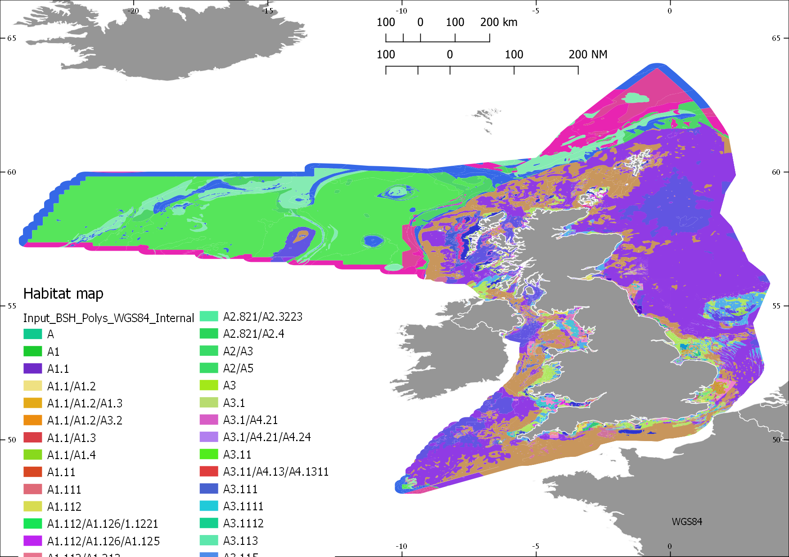
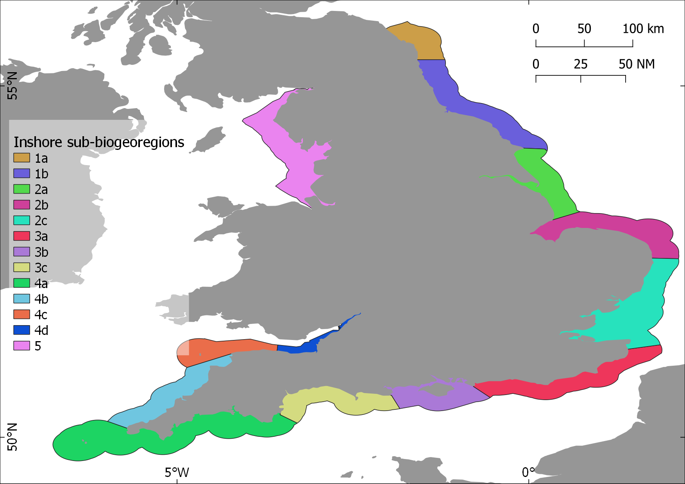
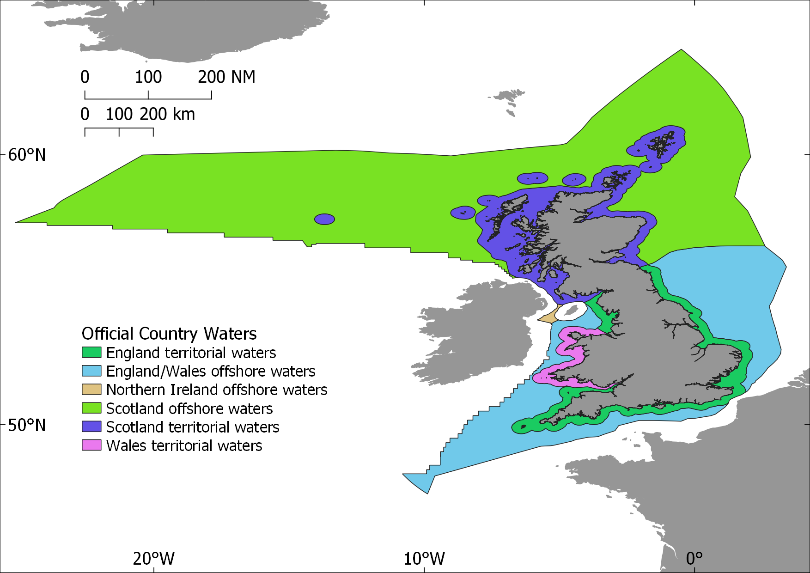

Habitat sensitivity R-scripting
========================================================
author: Philip Haupt
date: 2019-04-29
autosize: true
#width: 1440
#height: 900

Overview Slide
========================================================
left: 30%

<div class="header" style="margin-top:-100px;"align="right">
</img>
</div>


- Main script overview
        - Libraries
        - Functions (helper files)
        - User input section
- Stepwise process of following the data
        - GI Geoprocessing of habitat and boundaries and sub-biogeoregions
        - R Reading and processing
- Output
        - Written in R
        - Investigate outputs GIS

<div class="footer" style="margin-top:50px;">
</img>
</div>

        
Main script
========================================================
- A single main script is used to call a list of functions to execute in  a stepwise manner
- Readme at top provides some objective and basic instructions and infomration, like system requirements, for the user
- All neccesary R libraries are specified
- User input section is included at the top where universal variables are specified.


R Libraries used
========================================================
left: 50%
- First two are to read and connect to the database using ODBC connections.
- Tidyverse to stringr are to shape data and work with text data columns
- Rgdal and sf are to deal with GI data.


```
library(RODBC)
library(DBI)
library(tidyverse)
library(plyr)
library(reshape2)
library(magrittr)
library(stringr)
library(rgdal)
library(sf)
```
***


***


User input
========================================================


Choose operations
========================================================


Functions (helper files)
========================================================
<div align="left">

</div>

Each of these files contain commands to read, clean, shape, recombine the database data with the GIS data. They are called in a particular sequence from the Main script. Their outputs are passed into the R environemnt, where the next function picks up the output from the previous and and does the next step.

GI file preparation
========================================================
left: 60%


Fig. Habitat map

NE's *Benthic habitat* is **intersected** with *sub-bioregions* and *inshore/offshore boundaries*.
The benthic habitat layer is similar to the open source available on EMODnet, but includes a few classifications which NE have internally approved and have not ben accepted externally yet. This process developed is in clse collaboration with JNCC.

***

Fig. Sub-biogeoregions (inshore)


Fig. UK marine boundaries


R data processing steps: overview
========================================================


R data processing steps: step 1
========================================================

```
Column names:
```

```
[1] "ActivityCode" "ActivityName" "PressureCode" "PressureName"
[5] "EUNISCode"    "EUNISName"    "ActSensRank" 
```

```
Example of the data:
```

```
    ActivityCode   ActivityName PressureCode
299        Z10.6 Demersal trawl           D6
312        Z10.6 Demersal trawl           D6
154        Z10.6 Demersal trawl           D6
6          Z10.6 Demersal trawl           D6
289        Z10.6 Demersal trawl           D6
                                                          PressureName
299 Abrasion/disturbance of the substrate on the surface of the seabed
312 Abrasion/disturbance of the substrate on the surface of the seabed
154 Abrasion/disturbance of the substrate on the surface of the seabed
6   Abrasion/disturbance of the substrate on the surface of the seabed
289 Abrasion/disturbance of the substrate on the surface of the seabed
    EUNISCode ActSensRank
299   A5.3741         Low
312   A5.4411      Medium
154   A3.3131         Low
6      A1.121      Medium
289   A5.3541      Medium
```


